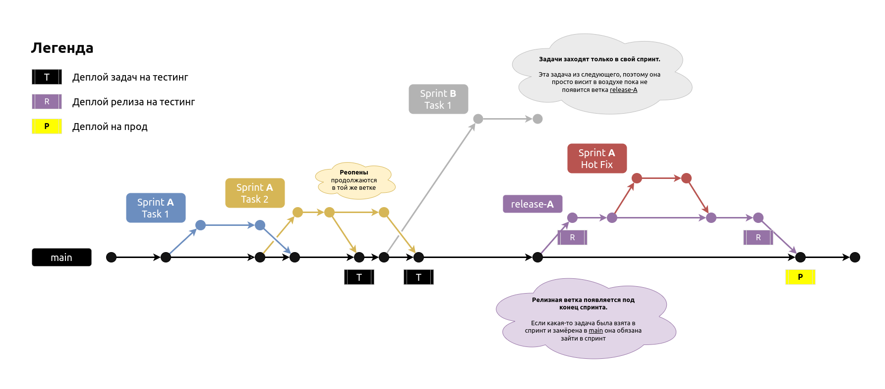

# Next.js Modern Starter 2024

This project is maintained by the Joy-Dev company.

## Reference

-   [Run Locally](#run-locally)
-   [Technical stack](#technical-stack)
-   [File structure](#file-structure)
    -   [Components folder](#components-folder)
-   [Code style](#code-style)
-   [Precommit / prettier](#prettier-and-pre-commit-lint-staged)
-   [Branch naming](#branch-naming)
-   [Commit naming](#commit-naming)
-   [Git flow](#git-flow)
-   [Special pages](#special-pages)
-   [Support](#support)

## Run Locally

Below are the instructions on how to run project locally:

Preconditions:
1. Install NVM ([windows](https://github.com/coreybutler/nvm-windows), [linux / macos](https://github.com/nvm-sh/nvm))

```bash
# Switch to correct node version
nvm install
nvm use
# Install pnpm - https://pnpm.io/
npm install -g pnpm
# Clone the project
git clone <gitlab-project-link>
# Go to the project directory
cd <project-folder>
# Install all dependencies
pnpm i
# Start the server in dev mode
pnpm dev
```

## Technical stack

1. [Next.js](https://nextjs.org/) - SSR React.js framework.
2. [Vanilla Extract CSS](https://vanilla-extract.style/) - Lib for writing styles.
3. [Zustand](https://zustand-demo.pmnd.rs/) - State management lib.
4. [clsx](https://www.npmjs.com/package/clsx) - Combinator for class names.
5. [Storybook](https://storybook.js.org/) - Framework for writing powerful docs for UI Kit.

## File structure

<details><summary><code>Press to open</code></summary>

```
.
├── .husky                         Contains tasks for precommit
├── .vscode                        All required plugins are stored here as recommendations
├── @types                         Global types
├── src                            Folder with all sources
│   ├── app                            Folder defining routing of app
│   ├── assets                         Folder with assets, could be imported from code
│   ├── components                     Check "Components folder" chapter
│   │   ├── blocks                         Check "Components folder" chapter
│   │   ├── common                         Check "Components folder" chapter
│   │   └── sections                       Check "Components folder" chapter
│   ├── stores                         Folders with all zustand stores
│   ├── styles                         Folders with all basic vanilla-extract/css styles
│   ├── constants                      Project constants
├── next.config.js                 Config for NextJS
├── next-env.d.ts                  Typing config for NextJS
├── out                            Folder with build
├── package.json                   Yarn package list and config
├── public                         Static files
│   ├── favicon.ico                    Favicon of site
│   └── fonts                          Folder with all fonts
└── README.md                      You are here
```

</details>
<br>

### Components folder

Folder `/src/components` is divided to few folders. Take a look at the main idea of this folders:

| Priority | Folder               | Idea                                                                                                                                                                                                        |
| -------- | -------------------- | ----------------------------------------------------------------------------------------------------------------------------------------------------------------------------------------------------------- |
| 1        | /src/components/sections | Usually each page is built from sections. So this folder contains sections for each page. SECTION - it is components taking full width of device.                                                           |
| 2        | /src/components/blocks   | Blocks are reusable components, used inside in sections. Main difference between Block and Section - Block can't take full width of page.                                                                   |
| 3        | /src/components/common   | This components could be used everywhere. By other words, components in this folder could be named as UI Kit of project. Any change in this folder have to be documented via storybook. |

## Code style

-   [TSX](./README/jsx-codestyle.md)

## Prettier and Pre-commit (lint-staged)

When any developer finished his work, he **commits** files and `lint-staged` package runs commands before making a commit.

It is run ONLY for **STAGED** files. So do not be worried to make commits.

```js
// Check TS files for no errors
	'**/*.(ts|tsx)': () => 'pnpm tsc --noEmit',

// Lint and format TS and JS files
'**/*.(ts|tsx|js)': (filenames) => [
    `pnpm eslint --fix ${filenames.join(' ')}`,
    `pnpm prettier --write ${filenames.join(' ')}`,
],
```

## Branch naming

Format of branch names:

> DJD-{task-number}-{short-description}

Examples:

-   `DJD-878-deploy-speedup` - if task exists when branch created
-   `NOTASK-deploy-speedup` - if task do not exists when branch created

## Commit naming

Format of commit messages:

> DJD-{task-number}: What has been done

Examples:

-   `DJD-878: Update ftp-smart-deploy lib to 0.1.2`
-   `DJD-894: Added shift and debugVideoPos. Upd docs`
-   `NOTASK: Branch logging in telegram`

## Git flow

We work in sprints. So git flow adjusted for sprint logic.

Graph:


Tips:

1. All tasks are forked from current `main`.
2. When task ready for code review - you create MR into current `main` branch.
3. If task do not pass tests, you simply fix bugs at same branch and merge it to `main` again.
4. At the end of sprint we create release branch to perform regression testing on testing stage.
5. All hot-fixed from regression testing are located on release branch.
6. After all fixed hot-fixes release branch merge to main.

## Special pages

Take a look to this pages at localhost:

1. http://localhost:3000/\_/docs - Docs of basic project components. Also some tips of mixin usage and accomplishments.
2. http://localhost:3000/\_/svgs - List of all project svg images with simple search. Created to prevent SVG duplication.

## Support

For any support, email maintainer of the project or:

-   fedor.nikonov@joy-dev.com

